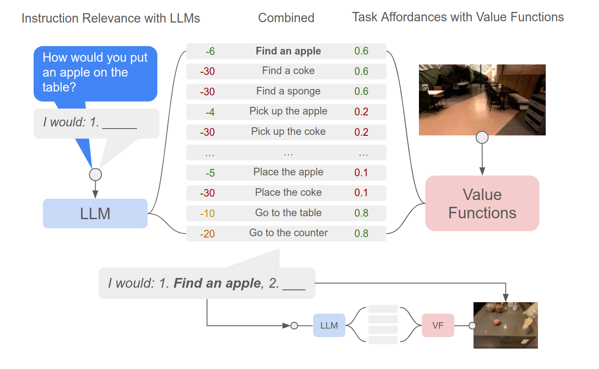

# SayCan 로봇 행동 계획 시스템 

본 프로젝트는 2022년 Google에서 제안한 언어 기반 로봇 행동 계획 알고리즘인 **SayCan**을 재구성한 Jupyter Notebook입니다.  
SayCan은 대형 언어모델(GPT)과 로봇의 행동 가능성 정보(Affordance)를 결합하여 자연어 지시를 실제 실행 가능한 행동으로 연결하는 시스템입니다.

> 📌 본 프로젝트는 Google Research에서 공개한 원본 노트북  
> [`SayCan-Robot-Pick-Place.ipynb`](https://github.com/google-research/google-research/blob/master/saycan/SayCan-Robot-Pick-Place.ipynb)  
> 를 기반으로, **최신 라이브러리와 GPU 환경에 맞도록 호환성 개선 및 재구현**한 버전입니다.

> 📎 참고 자료는 **노션 문서 _"혼자 공부하는 SAYCAN"_** 에 정리되어 있습니다.
> 

---

## 🔧 프로젝트 개요 및 수정 내역

SayCan의 원본 코드를 실행하는 과정에서 다음과 같은 주요 문제들이 발생:

- 2022년 기준으로 작성된 코드가 **구버전 라이브러리에 의존**함  
- PyTorch, TensorFlow, JAX, Flax, Transformers, OpenAI API 등의 **인터페이스 변경 또는 함수 제거**
- GPT 모델 호출 방식 변경으로 인한 **API 불호환 문제**

이에 따라 본 프로젝트에서는 전체 코드를 다음과 같이 개편:

- 더 이상 지원되지 않는 구문 제거 및 최신 문법 적용
- `transformers`, `jax`, `flax`, `optax`, `openai` 등 **최신 버전에 맞게 호환성 확보**
- GPT-3.5 기반의 OpenAI API로 **정밀도 및 안정성 개선**
- **NVIDIA RTX A6000 GPU 서버** 환경에 맞춰 JAX 및 CUDA 설정을 재정비
- 사용방법에 대해서는 Lab Wiki / Server / 학교서버 에 작성되어있음
- (로그인->패스워드->서버할당->로컬에 있는 파일을 서버로 이동->가상환경생성->라이브러리다운->실행)

---
## 🔐 OpenAI API 키 사용 관련 주의사항

본 프로젝트는 OpenAI GPT API를 사용합니다.  
반드시 **본인의 OpenAI API 키**를 사용해야 하며,  
**GitHub 보안 정책에 따라 코드에서 제외하였습니다.**

OPENAI_API_KEY=sk-xxxxxxxxxxxxxxxxxxxxxxxxxxxxxxxxxxxxxxxx

---
## ⚙️ 개발 환경 및 설치 방법

###  Conda 가상환경 설정 및 패키지 설치

```bash
# 가상환경 생성 및 활성화
conda create -n saycans python=3.9 -y
conda activate saycans

# CUDA + cuDNN (JAX, TensorFlow 공통 요구사항)
conda install -c conda-forge cudatoolkit=11.8 cudnn=8.9 -y

# 필수 파이썬 패키지
pip install jinja2 pyyaml typeguard
pip install tensorflow==2.11.0

# JAX + Flax + Optax (최신 안정 버전 기준, 중복 제거)
pip install --upgrade "jax[cuda11_pip]>=0.4.27" -f https://storage.googleapis.com/jax-releases/jax_cuda_releases.html
pip install --upgrade flax==0.8.2 optax==0.1.7 chex==0.1.7 orbax-checkpoint==0.6.4

# CLIP 관련
pip install openai easydict tqdm requests ftfy regex
pip install git+https://github.com/openai/CLIP.git

# 시각화 및 유틸
pip install matplotlib opencv-python
pip install charset_normalizer
pip install notebook
pip install tensorboard

# 영상처리
conda install -c conda-forge moviepy -y
pip install moviepy==1.0.3 imageio==2.9.0

# 수치 연산
pip install numpy==1.26.4 scipy==1.10.1

# 시뮬레이션
pip install pybullet

